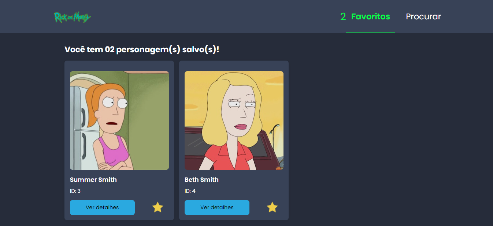
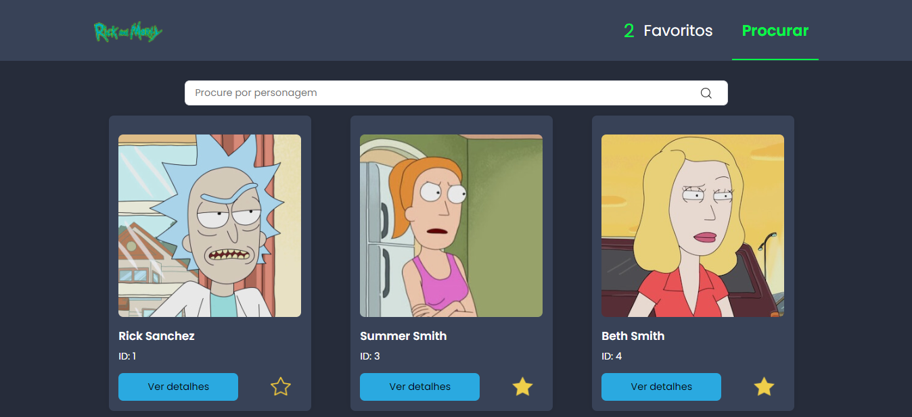
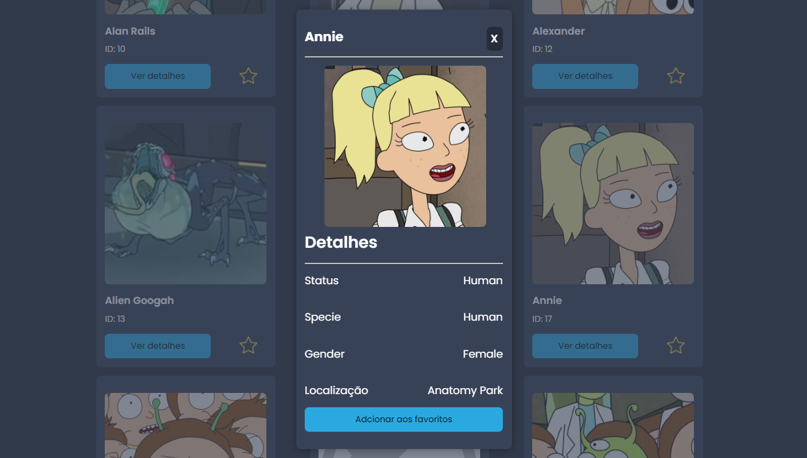

<h1 align="center">Rick and Morty Character Catalog ✅</h1>

<p align="left">This project was developed in JavaScript, using the React library and integrating with the Rick and Morty API (https://rickandmortyapi.com/documentation/).

<br />

The application consists of a searchable character listing screen and a details screen that displays detailed information about the character, as well as allowing the user to add the character to their favorites.

</p>

<br />

## 💻 Version 2.1

<br />

<div id="layout" align="center">
  <p align="stretch">
    
  </p>
</div>

<br />

<div id="layout" align="center">
  <p align="stretch">
    
  </p>
</div>

<br />

<div id="layout" align="center">
  <p align="stretch">
    
  </p>
</div>

<br />

Test yourself!!🔎 https://rick-and-morty-api-xi-ten.vercel.app/

<br />

## 🎡 Functionalities

- List of characters, with search by name.

- Character details including image, name, species, genus, status and current location.

- Opção para adicionar o personagem aos favoritos.

- Option to add character to favorites.

- Responsive layout, which adapts to different screen sizes and mobile devices.

<br />

## 🔧 Resources used

This project was developed with the following resources and technologies:

- [Next 13](https://nextjs.org/)
- [React](https://react.dev/)
- [React Router](https://reactrouter.com/en/main)
- [React Dom](https://legacy.reactjs.org/docs/react-dom.html)
- [JavaScript](https://developer.mozilla.org/pt-BR/docs/Web/JavaScript)
- [JSON](https://developer.mozilla.org/pt-BR/docs/Learn/JavaScript/Objects/JSON)
- [Node e NPM](https://nodejs.org/)
- [eslint](https://eslint.org/)
- [styled-components](https://styled-components.com/)

<br />

## 🚀 How to run the project

<br />

1. Clone the repository to your local machine.

```bash
$ git clone https://github.com/maarcusvinicius/RickAndMorty-API.git
```

2. Navigate to the project directory and install dependencies.

```bash
$ cd RickAndMorty-API
$ npm install
```

3. Start the development server.

```bash
$ npm start
```

4. Open your browser and go to http://localhost:3000 to view the application.

<br />


## 💻 Project structure

```bash
RickAndMorty-API/
  .next/
  node_modules/
  public/
    assets/
    icons/
  src/
    components/
      Buttons/
        DefaultButton.js
        FavoriteButton.js
        PrimaryButton.js
        RemoveFavoriteButton.js
      Cards/
        Card.js
        CardDetails.js
        CardList.js
      Loaders/
        CardLoader.js
      Container.js
      Input.js
      Navbar.js
      SearchField.js
    contexts/
      DataContext.js
      ModalContext.js
    pages/
      _app.js
      _document.js
      favorites.js
      index.js
      search.js
    styles/
      themes/
        dark.js
        index.js
      global.js
  .eslintrc.json
  README.md
  jsconfig.json
  next.config.js
  package-lock.json
  package.json
```

<br />

## 🏍️ Components

<br />

<h3>Buttons</h3>

- `DefaultButton`: This component renders a default button with a basic style.

- `FavoriteButton`: This component renders a button that adds a character from the favorites list. It uses the bookmarks context to manage the list.

- `PrimaryButton`: This component renders a button with a primary style.

- `RemoveFavoriteButton`: This component renders a button that removes a character from the favorites list. It uses the bookmarks context to manage the list.

<h3>Cards</h3>

- `Card`: This component renders a card with basic information about a character.

- `CardDetails`: This component renders the details of a character in a modal.

<h3>Loaders</h3>

- `CardLoader.js`: This component displays a circular loader while character data is being loaded. It is used on the character details page.

<h3>Others</h3>

- `Container.js`: This component is responsible for centering and defining the margins of the application's content. It is used on all pages.

- `Input.js`: This component is responsible for rendering a text input field with a search icon. It is used on the search page.

- `Navbar.js`: This component is responsible for rendering the application's navigation bar. It contains links to search and bookmark pages.

- `SearchField.js`: This component is responsible for rendering a search field that is used on the search page.

<h3>Contexts</h3>

- `DataContext.js`: This context is responsible for managing the global state of the characters that are displayed in the application. It stores character data, categorizes them, functions to search for characters and add/remove favorites.

- `ModalContext.js`: This context is responsible for managing the global state of the modal that is displayed when selecting a character.

<h3>Pages</h3>

- `_app.js:` This file is responsible for defining the basic structure of the application. It includes the context Provider.

- `_document.js:` This file is responsible for defining the basic structure of the HTML document. It includes the HTML, HEAD, and BODY tags, as well as the React root tag.

- `favorites.js`: This page displays the list of favorite characters that have been added by the user. It uses the CardList component to render favorite characters' cards.

- `index.js`: This index page redirects to the application path.

- `search.js`: This page displays a list of characters filtered by name search. It is possible to navigate between pages and add or remove favorite characters.


<br />
<br />
<h4 align="center"> 
	🚧  RickAndMorty-API ✅ FINISHED  🚧
</h4>
<br />
<br />
<br />
<br />
<br />
<br />
<br />

Made with ❤️ from Marcus Vinicius 👋🏽 Contact me!


//feito readme marcus


### 𝐇𝐞𝐥𝐥𝐨 𝐭𝐡𝐞𝐫𝐞, 𝐟𝐞𝐥𝐥𝐨𝐰 

I'm a Web Developer, a programmer looking to make <Br/>
a difference in the digital world. [**Profile Github**](https://github.com/maarcusvinicius). 🚀

#### My current tools
📲 Front-end Mobile with React Native  
🌎 Front-end Web with Reactjs  
📡 Back-end with Nodejs  
🛠️ Typescript  
🧰 And more...  


#### 💬 Find me elsewhere

[](https://www.linkedin.com/in/marcus-vinicius-507718228/)
[](marcus.editor77@gmail.com)
